# Network Centrality Top40 Strategy-(26-1 팀프로젝트)

네트워크 중심성 기반 포트폴리오 전략 repo입니다.

이 전략은 종목을 독립적인 점으로 보지 않고, 최근 수익률 상관관계로 연결된 네트워크의 노드로 봅니다. 목표는 단순히 소형주나 고배당주를 사는 것이 아니라, 시장 네트워크 안에서 구조적으로 의미 있는 위치를 가지면서도 시장 전체 공통축에는 과도하게 묶이지 않은 종목을 선별하는 것입니다.

## 한 줄 요약

주식 간 상관관계를 네트워크로 만들고, 시가총액 편향을 보정한 eigenvector centrality와 제1고유벡터 시장팩터 노출을 결합해 중심성 점수를 계산한 뒤, 점수 상위 종목군으로 포트폴리오를 구성하는 전략입니다.

## 폴더 구성

| 경로 | 역할 |
| --- | --- |
| `research-0321-0327/1st/` | 3주차 초기 중심성 전략 실험. 일별 점수, Jaccard 기반 적응형 리밸런싱, Entry Delay, 리드-래그 검증이 포함됩니다. |
| `final/` | 최종 전략 v2. 새 데이터셋 기준으로 Z-Score Composite를 매월 계산하고 Q5/Top40 성과, double sort, 거래비용 민감도, FF4 OLS를 산출합니다. |
| `sample_data/` | 비공개 원본을 대신해 입력 열 구조를 보여주는 합성 샘플. |

## 팀에서 맡은 역할

3인 팀으로 진행해 문제 정의, 데이터 점검, 전략 설계, 백테스트 해석, 투자 제안과 발표자료 제작을 한 사람에게 분리하지 않고 전원이 함께 검토했습니다. 저는 분석 과정 전반에 참여하면서 발표 장표 구성과 제작에도 직접 관여했습니다.

투자제안서의 필수 요구사항은 아니었지만, 최종 리밸런싱 시점 포트폴리오 구성종목 스냅샷을 보고 선정 종목이 실제 대형주와 어떤 관계로 연결되는지 별도로 조사했습니다. 발표 후 선배 심사자들이 해당 연결을 질문했을 때 조사 근거를 바탕으로 전략이 포착한 네트워크 관계를 설명할 수 있었습니다. 이 경험을 통해 정량 신호를 성과 숫자로 끝내지 않고 실제 기업 관계로 재확인하는 검증 습관을 배웠습니다.

## 전략 배경

전통적인 팩터 전략은 밸류, 모멘텀, 유동성처럼 개별 종목의 속성을 직접 사용합니다. 하지만 실제 시장에서는 종목들이 산업, 테마, 수급, 위험선호를 통해 서로 연결되어 움직입니다. 따라서 같은 재무지표를 가진 종목이라도 시장 네트워크에서 어떤 위치에 있는지에 따라 이후 수익률 분포가 달라질 수 있습니다.

이 전략은 최근 60거래일 수익률 상관구조를 이용해 종목 간 관계망을 만들고, 그 네트워크에서 의미 있는 위치를 가진 종목을 찾습니다. 단순 중심성을 그대로 쓰면 대형주와 시장 대표주가 과도하게 상위에 오르므로, 시가총액 보정과 시장 공통요인 감점을 함께 적용합니다.

결과적으로 선호하는 종목은 다음 조건을 갖습니다.

- 네트워크 안에서 완전히 고립되어 있지 않고 구조적으로 의미 있는 위치에 있음
- 시가총액이 크다는 이유만으로 중심성이 높게 평가되지 않음
- 제1고유벡터, 즉 시장 전체 공통축에 과도하게 노출되지 않음
- 유동성 필터와 가격 필터를 통과해 실제 매매 가능성이 있음

## 핵심 아이디어

### 1. 네트워크 구성

매월 말 기준 직전 60거래일의 일별 수익률로 종목 간 상관행렬을 계산합니다.

```math
C_t = \mathrm{Corr}(X_t)
```

결측치가 많은 종목은 제외하고, 상관행렬에는 Marchenko-Pastur clipping을 적용해 랜덤 노이즈 성격의 고유값을 평균값으로 치환합니다. 이 과정은 금융 상관행렬에서 의미 있는 공통구조와 잡음을 분리하기 위한 Random Matrix Theory 기반 전처리입니다.

정제된 상관행렬에서 음의 상관관계는 0으로 두고, 자기 자신과의 연결은 제거합니다.

```math
A_{ij,t} = \max\left(C^{\mathrm{clipped}}_{ij,t}, 0\right),
\qquad
A_{ii,t} = 0
```

이렇게 만든 `A_t`가 종목 네트워크의 가중 인접행렬입니다.

### 2. 시가총액 보정 중심성

일반 eigenvector centrality는 네트워크에서 중요한 노드와 많이 연결된 노드에 높은 점수를 줍니다.

```math
A_t x_t = \lambda_t x_t
```

하지만 한국 주식시장에서는 대형주가 거래량, 커버리지, 지수 편입 효과 때문에 중심성이 높게 나올 수 있습니다. 이를 완화하기 위해 중심성과 시가총액의 로그 관계를 회귀하고, 그 기울기의 절반을 시가총액 페널티 강도로 사용합니다.

```math
\log(\mathrm{centrality}_{i,t})
= \alpha_t + \beta_t \log(\mathrm{mcap}_{i,t}) + \varepsilon_{i,t}
```

```math
d_{\beta,t} = \frac{|\beta_t|}{2}
```

Cap-Scaled Centrality는 다음처럼 계산합니다.

```math
x^{\mathrm{new}}_t
= \mathrm{diag}\left(\frac{1}{\mathrm{mcap}_t^{d_{\beta,t}}}\right)
A_t x^{\mathrm{old}}_t
```

완전히 대형주를 제거하는 것이 아니라, 대형주 편향을 절반 정도만 보정해 과보정을 피하는 구조입니다.

### 3. 시장 공통축 감점

상관행렬의 제1고유벡터는 시장 전체 공통 움직임, 즉 market mode를 많이 담습니다. 이 전략은 네트워크상 의미는 있지만 시장 전체와 너무 동조화된 종목을 피하기 위해 제1고유벡터 loading에 감점을 줍니다.

감점 강도는 데이터에서 매월 도출합니다.

```math
w_t = \sqrt{\frac{\lambda_{2,t}}{\lambda_{1,t}}}
```

`lambda_1`이 지배적이면 시장 공통축이 강하다는 뜻이고, `lambda_2`가 상대적으로 커질수록 시장 외 구조가 더 살아난다는 뜻입니다.

### 4. Z-Score Composite

최종 버전은 rank 방식 대신 z-score 방식으로 중심성과 시장 공통축 노출을 같은 스케일에 맞춥니다.

```math
z^{\mathrm{centrality}}_{i,t}
= \frac{\mathrm{centrality}_{i,t} - \mu_t(\mathrm{centrality})}
{\sigma_t(\mathrm{centrality})}
```

```math
z^{\lambda_1}_{i,t}
= \frac{\mathrm{loading}^{\lambda_1}_{i,t} - \mu_t(\mathrm{loading}^{\lambda_1})}
{\sigma_t(\mathrm{loading}^{\lambda_1})}
```

```math
\mathrm{CompositeScore}_{i,t}
= z^{\mathrm{centrality}}_{i,t} - w_t z^{\lambda_1}_{i,t}
```

점수가 높을수록 `중심성은 높지만 시장 공통축 노출은 낮은 종목`으로 해석합니다.

### 5. 투자 전 필터

네트워크 계산에는 가능한 많은 종목을 참여시키되, 실제 포트폴리오 편입 직전에는 매매 가능성과 시장팩터 오염을 줄이는 필터를 적용합니다.

| 필터 | 목적 |
| --- | --- |
| 60일 평균 거래대금 하위 10% 제외 | 실매매가 어려운 극저유동 종목 제거 |
| 시가총액 상위 `cutoff` 제외 | 시장 공통축에 오염된 대표 대형주 제거 |
| 거래정지 종목 제외 | 월초/월말 가격이 같은 종목 제거 |
| SPAC 제외 | 특수목적법인 제거 |
| 1,000원 미만 동전주 제외 | 가격 왜곡과 실거래 위험 완화 |

시가총액 상위 제외 비율은 고정값이 아니라 매월 데이터에서 도출합니다.

```math
\mathrm{cutoff}_t
= \min\left(
\sqrt{\frac{\lambda_{1,t}}{\mathrm{tr}(\Lambda_t)}},
0.8
\right)
```

시장 전체가 하나의 공통축에 더 강하게 묶이는 시기에는 `lambda_1` 비중이 커지고, 그만큼 더 많은 대형주가 제외됩니다.

## 1st 버전: Jaccard + Entry Delay

`research-0321-0327/1st/final_strategy.py`는 초기 중심성 전략의 최종 실험 버전입니다.

특징은 다음과 같습니다.

- `daily_scores.csv`에 저장된 일별 중심성 점수를 사용
- `lead_lag_pairs.csv`에서 기간별 평균 래그를 계산
- Q5 진입 신호가 일정 기간 유지되는지 확인하는 Entry Delay 적용
- 직전 리밸런싱 Q5와 현재 Q5의 Jaccard 유사도가 0.3 미만일 때만 리밸런싱
- ScorePow 방식으로 점수 높은 종목에 더 큰 비중 배분
- Amihud illiquidity 기준 차등 거래비용 적용

Jaccard 기준은 포트폴리오 구성 변화가 충분히 클 때만 거래하겠다는 원칙입니다.

```math
J(A,B) = \frac{|A \cap B|}{|A \cup B|}
```

유사도가 0.3 미만이라는 것은 구성 종목의 상당수가 바뀌었다는 뜻입니다. PPT 기준으로 고정 월간 리밸런싱 대비 리밸런싱 횟수는 189회에서 111회로 줄고, 턴오버는 94.2%에서 73.3%로 감소했습니다.

PPT의 3주차 발표 기준 성과는 다음과 같이 정리되어 있습니다.

| 포트폴리오 | CAGR | Sharpe | Volatility | MDD |
| --- | ---: | ---: | ---: | ---: |
| Jaccard 0.3 Signal Portfolio | 20.46% | 0.87 | 22.10% | -28.14% |
| Size 40 Portfolio | 24.19% | 0.99 | 22.40% | -29.20% |

## 최종 버전: Z-Score Composite + 월간 리밸런싱

`final/final_strategy_v2.py`는 최종 데이터셋을 사용해 중심성 점수를 월간으로 재계산하는 버전입니다.

최종 버전은 다음 차이가 있습니다.

- `daily_scores.csv` 의존도를 줄이고 원천 데이터에서 매월 점수를 직접 계산
- rank 기반 composite 대신 z-score composite 사용
- Q1~Q5 분위별 성과를 같이 계산해 단조성 검증
- Q5 포트폴리오에는 동일가중을 적용
- NAV 기반으로 거래비용을 차감
- `monthly_scores.csv`, `final_strategy_v2.png`, `final_strategy_v2_nav.xlsx`를 산출

`final/final_v2_output.txt` 기준 실행 결과는 다음과 같습니다.

| 항목 | 값 |
| --- | ---: |
| 기간 | 2000-01 ~ 2025-12 |
| 유니버스 | 3,751개 종목 |
| Q1 CAGR | -6.15% |
| Q2 CAGR | 4.09% |
| Q3 CAGR | 9.46% |
| Q4 CAGR | 11.77% |
| Q5 CAGR | 23.62% |
| Q5 수수료후 CAGR | 17.62% |
| Q5 수수료후 Volatility | 32.0% |
| Q5 수수료후 Sharpe | 0.60 |
| Q5 수수료후 MDD | -54.4% |
| 평균 턴오버 | 86.1% |
| Carhart 4-Factor Alpha | 16.59% |
| Alpha t-stat | 4.50 |

OLS 결과는 다음과 같습니다.

| Factor | Coefficient | 해석 |
| --- | ---: | --- |
| MKT | 1.1810 | 시장 노출이 1보다 약간 높음 |
| SMB | 1.0086 | 소형주 노출이 큼 |
| HML | 0.0154 | 가치 팩터 노출은 거의 없음 |
| MOM | -0.5172 | 모멘텀과 반대 방향의 contrarian 성격 |

Q1에서 Q5로 갈수록 CAGR이 단조 증가하므로, composite score가 단순 노이즈가 아니라 수익률 분포와 연결된 신호라는 점을 확인할 수 있습니다.

## 결과 차트

아래 이미지는 저장소에서 바로 확인할 수 있으며, 클릭하면 원본 크기로 열립니다.

<table>
  <tr>
    <td width="50%"><strong>최종 전략 성과</strong><br><a href="final/final_strategy_v2.png">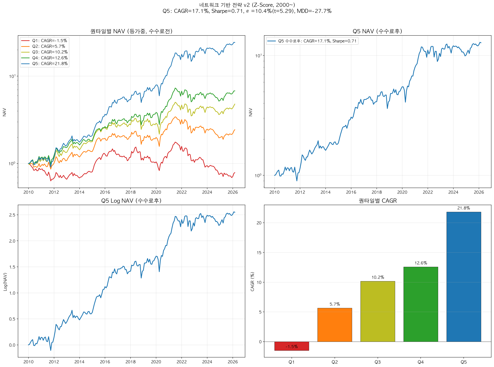</a></td>
    <td width="50%"><strong>분위별 성과</strong><br><a href="final/final_figure/Qunatile.png">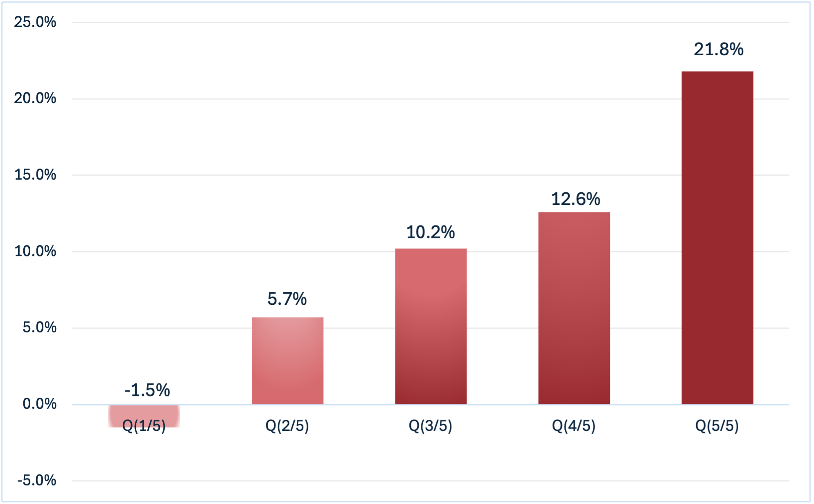</a></td>
  </tr>
  <tr>
    <td width="50%"><strong>Q5 NAV</strong><br><a href="final/final_figure/Q5_nav_c.png">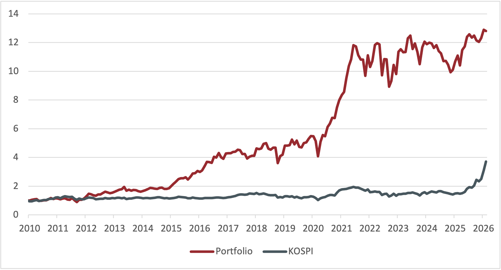</a></td>
    <td width="50%"><strong>Top40 NAV</strong><br><a href="final/final_figure/top40_nav_c.png">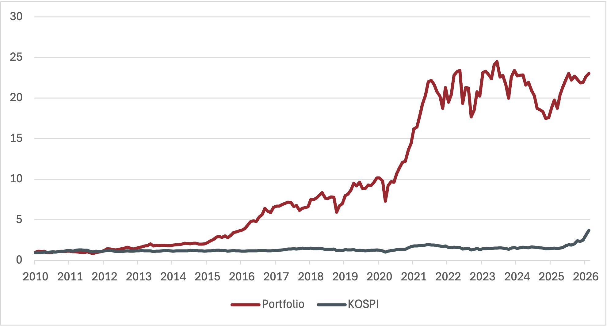</a></td>
  </tr>
  <tr>
    <td width="50%"><strong>Q5 날짜별 NAV</strong><br><a href="final/final_figure/Q5_nav_date.png">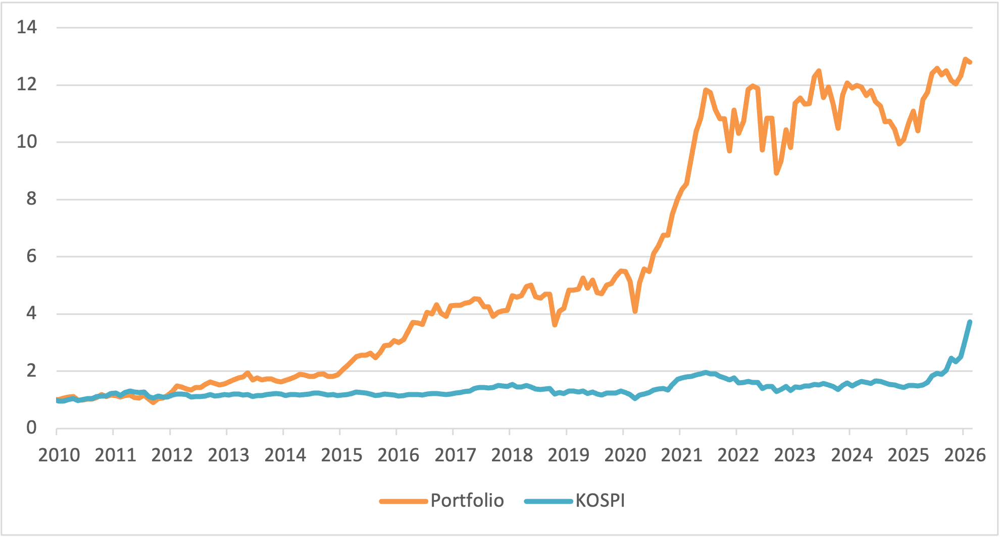</a></td>
    <td width="50%"><strong>Top40 날짜별 NAV</strong><br><a href="final/final_figure/top40_nav_date.png">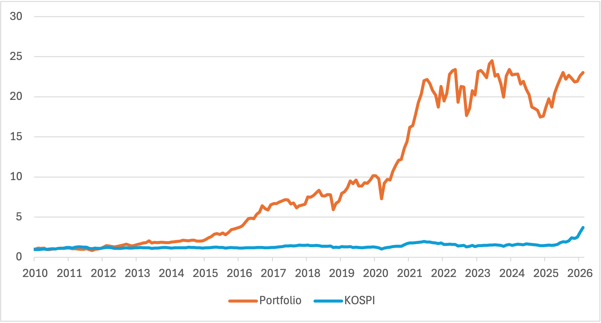</a></td>
  </tr>
  <tr>
    <td width="50%"><strong>Q5 로그 NAV</strong><br><a href="final/final_figure/Q5_nav_log.png">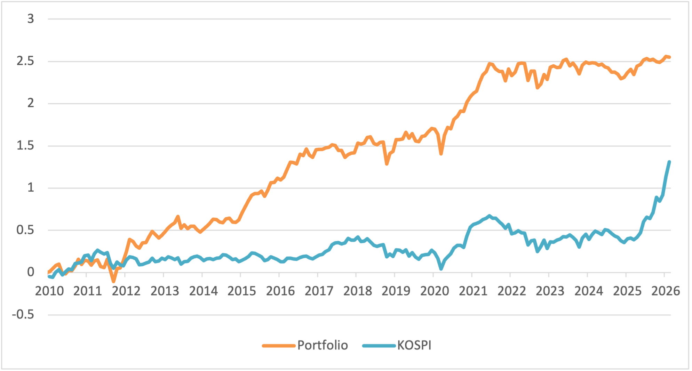</a></td>
    <td width="50%"><strong>Q5 로그 누적성과</strong><br><a href="final/final_figure/Q5_log_c.png">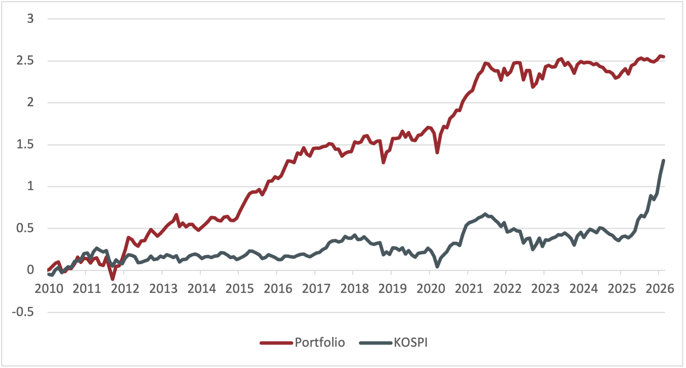</a></td>
  </tr>
  <tr>
    <td width="50%"><strong>Top40 로그 NAV</strong><br><a href="final/final_figure/top40_log.png">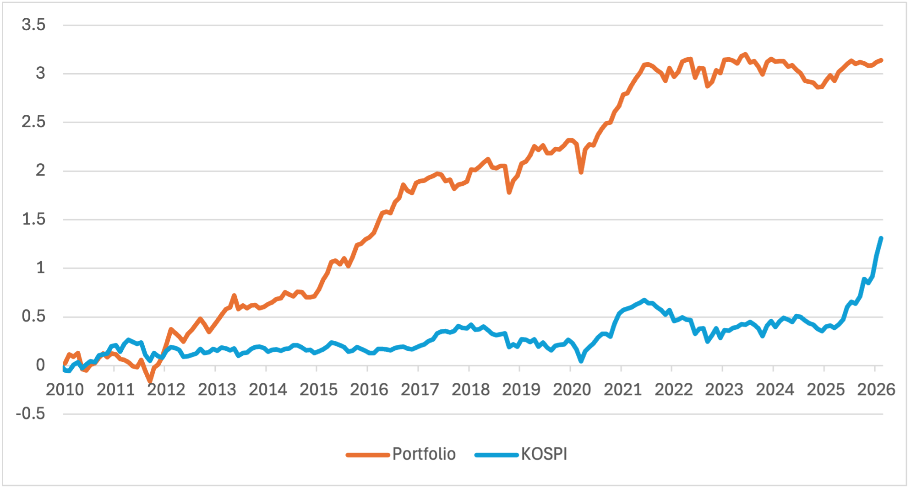</a></td>
    <td width="50%"><strong>Top40 로그 누적성과</strong><br><a href="final/final_figure/top40_log_c.png">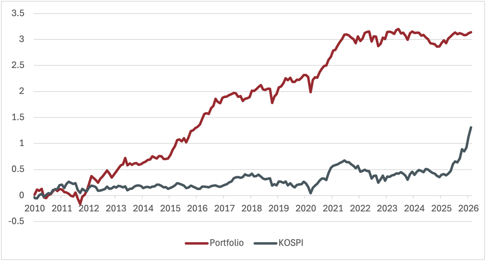</a></td>
  </tr>
  <tr>
    <td width="50%"><strong>Top40 거래비용</strong><br><a href="final/final_figure/top40_transaction_cost.png">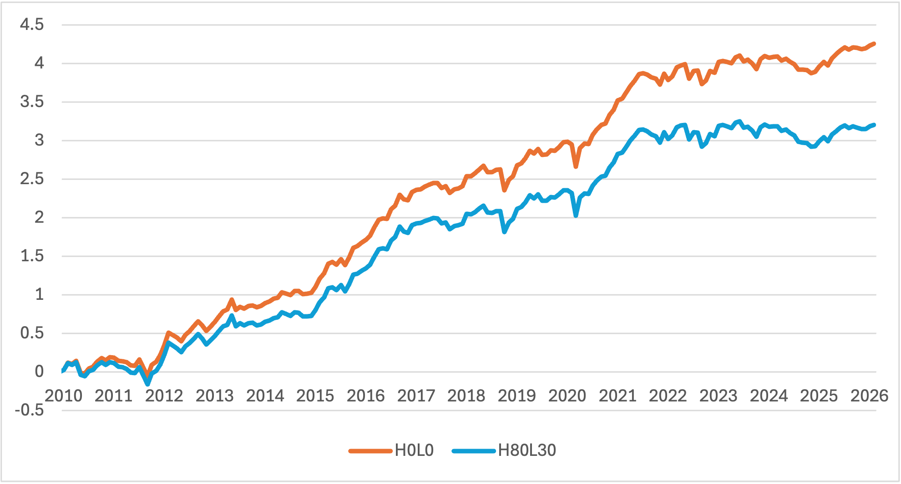</a></td>
    <td width="50%"><strong>Top40 승률</strong><br><a href="final/final_figure/winratetop40.png">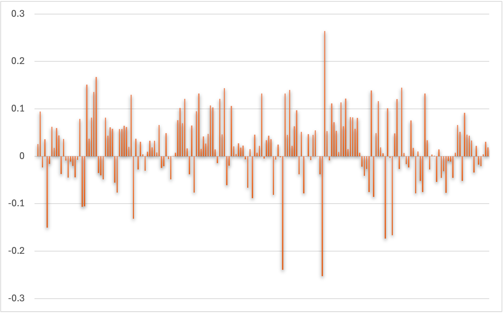</a></td>
  </tr>
  <tr>
    <td width="50%"><strong>시총-중심성 CAGR Double Sort</strong><br><a href="final/double_sort_cagr_heatmap_original.png">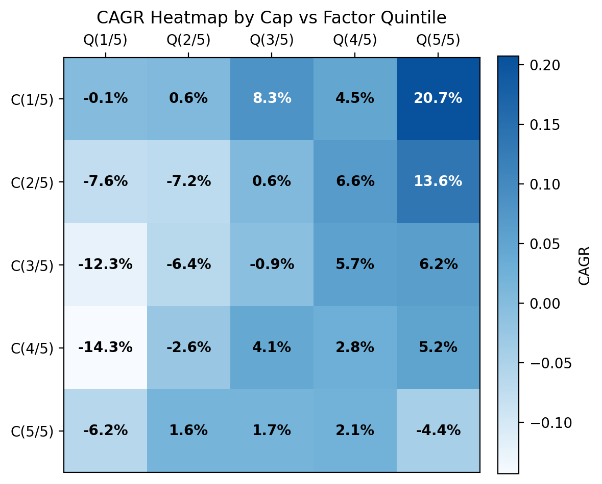</a></td>
    <td width="50%"><strong>시총-중심성 Sharpe Double Sort</strong><br><a href="final/double_sort_sharpe_heatmap.png">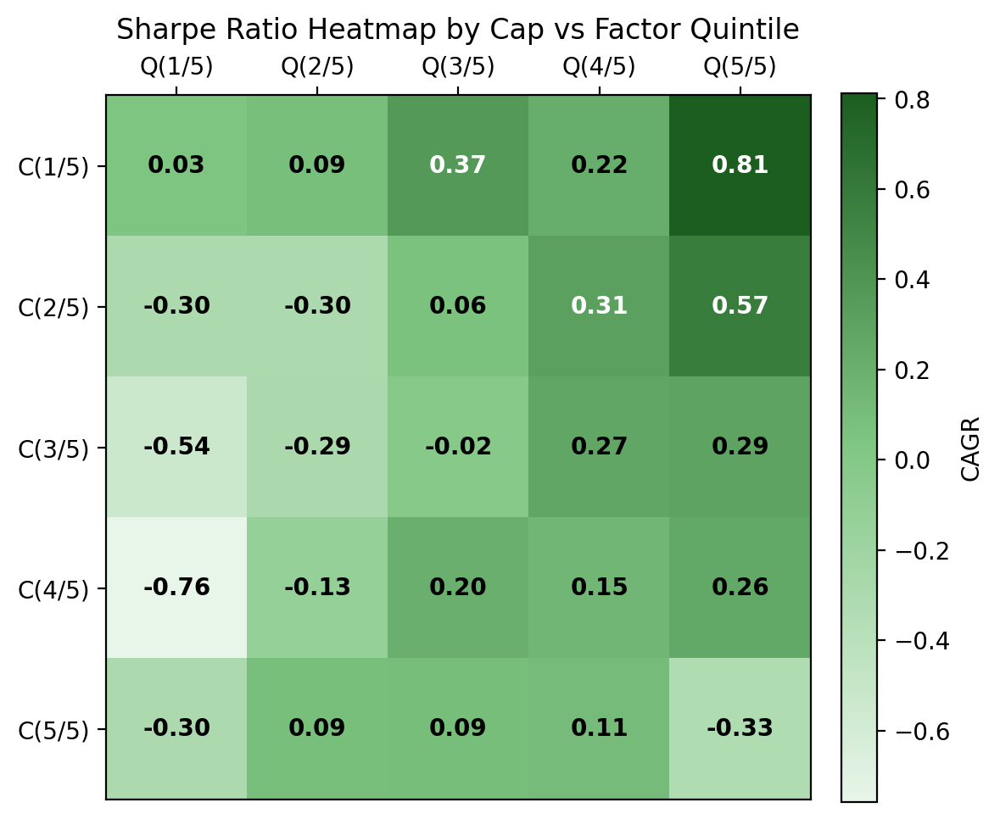</a></td>
  </tr>
  <tr>
    <td width="50%"><strong>발표용 CAGR 히트맵</strong><br><a href="final/double_sort_cagr_heatmap_custom.png">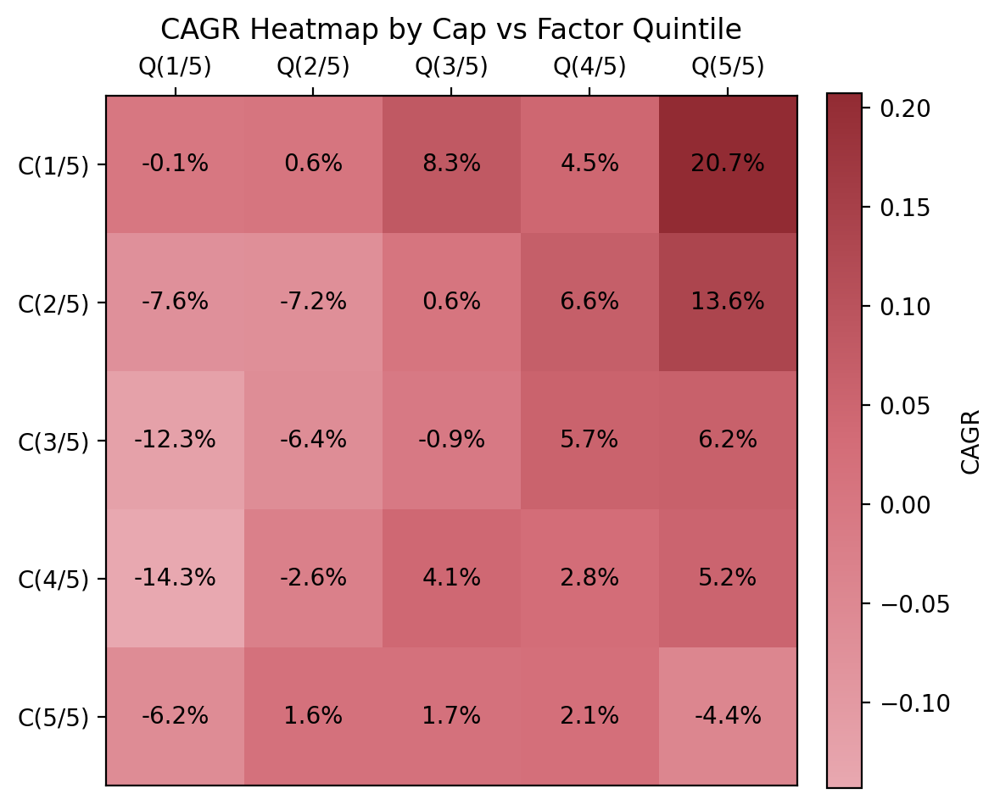</a></td>
    <td width="50%"><strong>초기 윈저라이징·Amihud 실험</strong><br><a href="research-0321-0327/1st/winsorize_amihud_heatmap.png">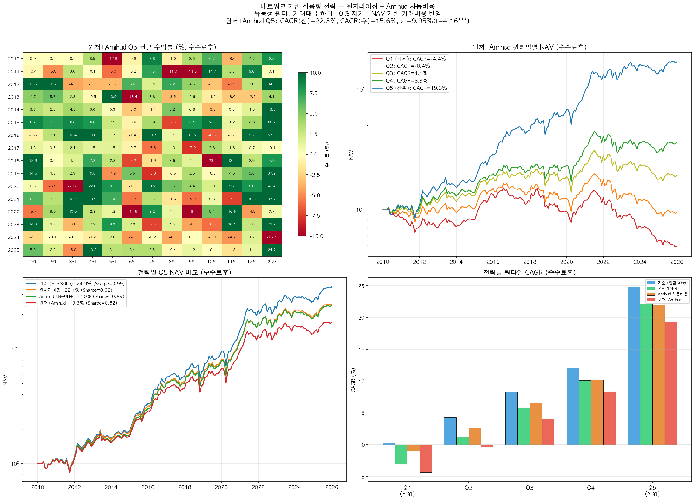</a></td>
  </tr>
</table>

## Top40 산출물

`final/export_q5_top40_nav.py`는 `monthly_scores.csv`를 이용해 Q5와 Top40 포트폴리오의 NAV를 내보내는 스크립트입니다. `final/q5_top40_nav.xlsx`와 `final/final_figure/`의 그림들은 최종 발표/보고서용 산출물입니다.

PPT에서는 Size 40 Portfolio가 별도로 강조되어 있으며, 이는 composite score 상위 종목을 더 압축적으로 사용했을 때의 성과를 보여주는 보조 검증입니다.

## Double Sort 검증

`final/export_double_sort_heatmap.py`는 시가총액 5분위와 composite score 5분위를 교차한 5x5 포트폴리오를 만듭니다.

목적은 이 전략이 단순히 소형주 효과만 잡은 것인지 확인하는 것입니다. 같은 시가총액 분위 안에서도 score가 높을수록 CAGR과 Sharpe가 개선되면, 중심성 신호가 크기 효과와 별개로 작동한다는 근거가 됩니다.

산출물:

- `final/double_sort_cagr_heatmap.xlsx`
- `final/double_sort_cagr_heatmap_original.html`
- `final/double_sort_cagr_heatmap_original.png`
- `final/double_sort_sharpe_heatmap.xlsx`
- `final/double_sort_sharpe_heatmap.html`
- `final/double_sort_sharpe_heatmap.png`

## 거래비용 민감도

`final/export_final_strategy_cost_sensitivity.py`는 거래비용 시나리오를 비교합니다.

| 시나리오 | 의미 |
| --- | --- |
| `H0L0` | 거래비용 0bp |
| `H80L30` | Amihud 상위 20% 비유동 종목 80bp, 나머지 30bp |

이 전략은 거래대금이 낮은 종목을 일부 포함할 수 있으므로, 단순 고정비용보다 종목별 유동성에 따라 비용을 다르게 적용하는 방식이 더 현실적입니다.

## 주요 파일

### `research-0321-0327/1st`

| 파일 | 설명 |
| --- | --- |
| `final_strategy.py` | Jaccard 0.3 + Entry Delay 기반 초기 최종 전략 |
| `daily_scores_trigger_backtest.py` | 일별 점수 trigger 백테스트 |
| `daily_scores_trigger_test.py` | trigger 테스트 |
| `best_from2010.py` | 2010년 이후 기준 후보 실험 |
| `winsorize_amihud_test.py` | 윈저라이징과 Amihud 비용 실험 |
| `strategy_description_final.txt` | 초기 전략 최종 설명 문서 |
| `strategy_full_description.txt` | 전체 프로시저 설명 문서 |
| `KOSPI200.csv` | 로컬에서 준비하는 벤치마크/비교용 원본 |
| `회귀분석_코스피.csv` | 로컬에서 준비하는 Carhart 4팩터 원본 |
| `winsorize_amihud_heatmap.png` | 초기 실험 시각화 |

### `final`

| 파일 | 설명 |
| --- | --- |
| `final_strategy_v2.py` | 최종 전략 v2 메인 실행 파일 |
| `final_v2_output.txt` | 최종 전략 v2 실행 로그와 성과 요약 |
| `final_strategy_v2.png` | 최종 전략 성과 시각화 |
| `final_strategy_v2_nav.xlsx` | 최종 전략 NAV 결과 |
| `monthly_scores.csv` | 월별 composite score 저장 결과 |
| `export_q5_top40_nav.py` | Q5/Top40 NAV 산출 |
| `q5_top40_nav.xlsx` | Q5/Top40 NAV 결과 |
| `export_double_sort_heatmap.py` | 5x5 double sort heatmap 산출 |
| `export_final_strategy_cost_sensitivity.py` | 거래비용 민감도 산출 |
| `export_ff4_ols.py` | FF4 OLS 결과 산출 |
| `ff4_ols_results.csv`, `ff4_ols_results.xlsx` | FF4 OLS 결과 |
| `final_figure/` | 최종 발표/보고서용 그림과 표 |

## 공개 데이터 정책

공개 전환 과정에서 가격·시가총액·거래대금·팩터·벤치마크 원본은 크기와 관계없이 저장소와 공개 Git 이력에서 제거했습니다. 공개 저장소에는 코드, 합성 샘플 스키마와 생성 방법, 파생 결과표와 차트만 포함합니다.

```bash
python scripts/generate_sample_data.py
```

`sample_data/README.md`에서 최종 코드가 기대하는 열 구조를 확인할 수 있습니다. 샘플 값은 인위적으로 생성했으며 공개된 성과에는 사용하지 않았습니다. 재실행하려면 이용 권한을 확보한 아래 계열의 파일이 로컬에 필요합니다.

- `수정주가.csv`
- `수정주가_거래대금필터_code.csv`
- `거래대금.csv`
- `60_거래대금.csv`
- `시가총액.csv`
- `현금배당포함.csv`
- `daily_scores.csv`
- `lead_lag_pairs.csv`
- `total adj close.csv`
- `trading value.csv`
- `trading value 60.csv`

원본 파일은 `.gitignore`로 차단하며, 공개 저장소에는 파생 산출물만 남깁니다.

## 실행 환경

```bash
pip install -r requirements.txt
```

최종 전략을 재실행하려면 `final/` 폴더에서 대용량 원천 데이터를 같은 경로에 둔 뒤 실행합니다.

```bash
cd final
python final_strategy_v2.py
```

추가 산출물은 필요에 따라 아래 스크립트로 생성합니다.

```bash
python export_q5_top40_nav.py
python export_double_sort_heatmap.py
python export_final_strategy_cost_sensitivity.py
python export_ff4_ols.py
```

## 주의

- 연구 및 백테스트 목적의 정리본입니다.
- 과거 데이터 기반 결과이며 투자 성과를 보장하지 않습니다.
- 원본 데이터는 공개하지 않으므로 완전 재현에는 적법하게 확보한 로컬 입력이 필요합니다.
- 합성 샘플은 스키마 설명용이며, 공개된 성과표와 차트는 기존 연구 실행의 파생 산출물입니다.
